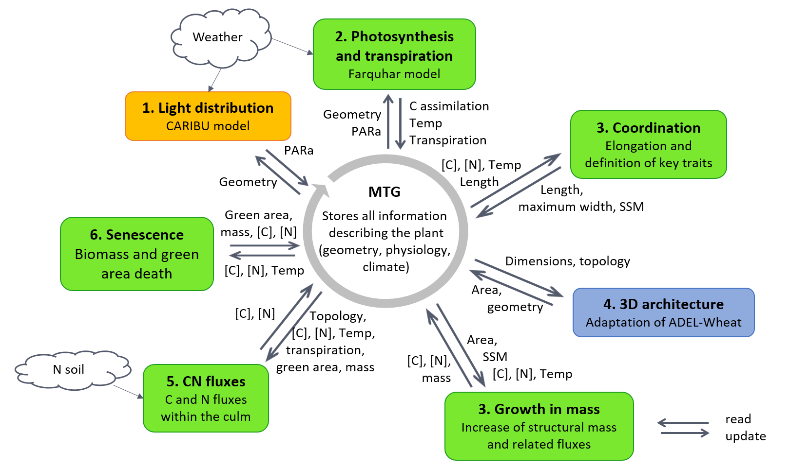

# WheatFspm
WheatFspm is a Functional Structural Plant Model (FSPM) of wheat based on an innovative modelling framework for a better understanding of grass morphogenesis and C-N economy in interaction with environmental conditions

# Description
WheatFspm consists in a set of sub-models (named submodules in git) which share inputs/outputs through an MTG object:

 
*Adapted from Gauthier et al. (2020)*

* *Farquhar-Wheat*: Farquhar-based model of photosynthesis, stomatal conductance, organ temperature and transpiration.
* *Elong-Wheat*: regulation of leaf and internode elongation by C and N metabolites, temperature and coordination rules.
* *Growth-Wheat*: growth in biomass of leaves, internodes and roots ; related consumption in C and N metabolites.
* *CN-Wheat*: synthesis and degradation of C and N metabolites at organ level and allocation between tillers' organs.
* *Respi-Wheat*: respiratory-costs related to the main biological processes.
* *Senesc-Wheat*: organ senescence and consequences in organ biomass, green area and remoblisation of C and N metabolites.
* *Fspm-Wheat*: interfaces (facades) for reading/updating information between each sub-model and the MTG. Also includes the scripts to be run for using all sub-models.

# Table of Contents
- [WheatFspm](#wheatfspm)
- [Description](#description)
- [Table of Contents](#table-of-contents)
- [Installation](#installation)
  * [Prerequisites](#prerequisites)
  * [Installing](#installing)
    + [Users](#users)
    + [Developers](#developers)
- [Usage](#usage)
  * [NEMA](#nema)
  * [Papier_FSPMA2016](#papier_fspma2016)
  * [Vegetative stages](#vegetative-stages)
  * [Scenarii_monoculms](#scenarii-monoculms)
- [Credits](#credits)
  * [Authors](#authors)
  * [Contributors](#contributors)
  * [Funding](#funding)
- [License](#license)

# Installation

*WheatFspm* has been tested on Windows 10 64 bit and Linux Fedora 24 64 bit.

## Prerequisites
To install and use *WheatFspm*, you need first to install the following dependencies:
* To run the model: 
    * [Python](http://www.python.org) >= 2.7 (not tested for Python 3)
    * [NumPy](http://www.numpy.org/) >= 1.7.2
    * [SciPy](http://www.scipy.org/) >= 0.12.1
    * [Pandas](http://pandas.pydata.org/) >= 0.14.0 
    * [Openalea.MTG](https://github.com/openalea/mtg)
    * [Openalea.Plantgl](https://github.com/openalea/plantgl)
    * [Openalea.Lpy](https://github.com/openalea/lpy)
    * [Alinea.Caribu](https://github.com/openalea-incubator/caribu) 
    * [Alinea.Adel](https://github.com/openalea-incubator/adel)
    * [Alinea.Astk](https://github.com/openalea-incubator/astk)
    
* To run the tools: [Matplotlib](http://matplotlib.org/) >= 1.3.1 
* To build the documentation: [Sphinx](http://sphinx-doc.org/) >= 1.1.3
* To run the tests: [Nose](http://nose.readthedocs.org/) >= 1.3.0 

## Installing
### Users
* Download WheatFspm package from https://github.com/openalea-incubator/WheatFspm/archive/master.zip
* Extract archive
* Open a command line interpreter in your local copy of *WheatFspm*,
* Run command: `python setup.py install --user` 

### Developers

This  package contains Git [submodules](https://git-scm.com/book/en/v2/Git-Tools-Submodules) ([in French](https://git-scm.com/book/fr/v2/Utilitaires-Git-Sous-modules)).

Development is done in the different submodules.

#### Cloning

To clone the project, please use:

    git clone --recurse-submodules https://github.com/openalea-incubator/WheatFspm

#### Updating submodules

If you want to update all submodules:

    git submodule update --remote

Otherelse, update each one to a specific version, branch or tag, do:

    cd mypackage
    git fetch
    git merge origin/master

#### Install packages in develop mode

* Open a command line interpreter into each copy of submodels
* Run command: `python setup.py develop --user`

# Usage

The scripts to run *WheatFSPM* are located in `fspm-wheat\example`

## NEMA
This example deals with the post-flowering stages of wheat developement under 3 nitrogen fertilisation regies (H0, H3 and H15). The main processes described are leaf senescence, C and N remobilisation, grain filling). During that stages, all vegetative organs have completed their growth. 
This work led to the research articles [Barillot *et al.* (2016a)](https://doi.org/10.1093/aob/mcw143) and [Barillot *et al.* (2016b)](https://doi.org/10.1093/aob/mcw144).
This example has been maintained in the current version ; results of above papers were generated using the tag *release-1.0* of *CN-Wheat*. 

To run the example:
* Open a command line interpreter in `WheatFspm\fspm-wheat\example\NEMA`
* Run each script called *main.py* located in *NEMA_H0*, *NEMA_H3*, *NEMA_H15*: `python main.py`

## Papier_FSPMA2016
This example deals with the effects of leaf inclination, radiations regimes, plant density and sowing patterns on plant metabolism and grain filling during the post-flowering stages.   
This work led to the research article [Barillot *et al.* (2019)](https://doi.org/10.1093/aob/mcy208).
The scripts have not been maintained in the current version but are available using tags *paper_FSPMA16* or each submodule.

To run the example:
* Open a command line interpreter in `WheatFspm\fspm-wheat\example\Papier_FSPMA2016`
* Run each script called *main.py* located in the different sub-directories: `python main.py`

## Vegetative stages
This example deals with the early vegetative stages of wheat development. It mainly covers the processes of leaf, internode and roots growth.
Tillering is simplified: tiller emergence is a model input while tiller metabolism and growth is approximated from that  of the main stem.
This work led to the research article [Gauthier *et al.* (2020)](todo). Results were obtained from the tag [paper_JXBot_2020](https://github.com/openalea-incubator/WheatFspm/releases/tag/paper_JXBot_2020).
Code archives and Singularity container  
 
To run the example:
* Open a command line interpreter in `WheatFspm\fspm-wheat\example\Vegetative_stages`
* Run script *main.py*: `python main.py`

## Scenarii_monoculms
Work in progress for simulating wheat plasticity to contrasted environments

# Credits
## Authors
* Romain BARILLOT - model designing, development and validation - [rbarillot](https://github.com/rbarillot)
* Marion GAUTHIER - model designing, development and validation - [mngauthier](https://github.com/mngauthier)
* Camille CHAMBON - software designing, development, deployment and optimization - [cachambon](https://github.com/cachambon)
* Bruno ANDRIEU - model designing and validation, scientific project management - [bandrieu](https://orcid.org/0000-0002-7933-9490)

## Contributors
* Christian FOURNIER - [christian34](https://github.com/christian34)
* Christophe PRADAL - [pradal](https://github.com/pradal)

## Funding
* [INRAE](https://www.inrae.fr/): salaries of permanent staff 
* French Research National Agency: projects [Breedwheat](https://breedwheat.fr/) (ANR-10-BTBR-03) and [Wheatamix](https://www6.inrae.fr/wheatamix/) (ANR-13-AGRO0008): postdoctoral research of R.Barillot
* [itk](https://www.itk.fr/en/) company: funded the PhD thesis of M.Gauthier

# License
This project is licensed under the CeCILL-C License - see file [LICENSE](LICENSE) for details
 
